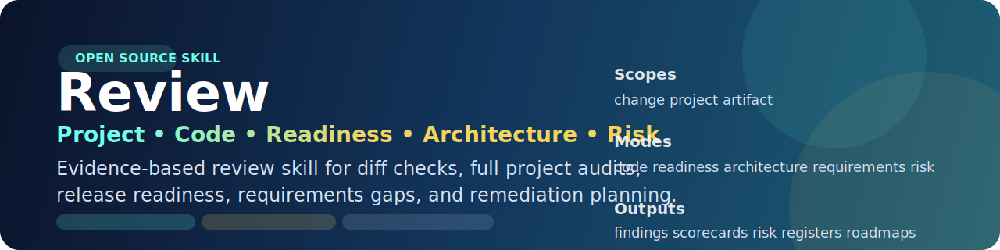
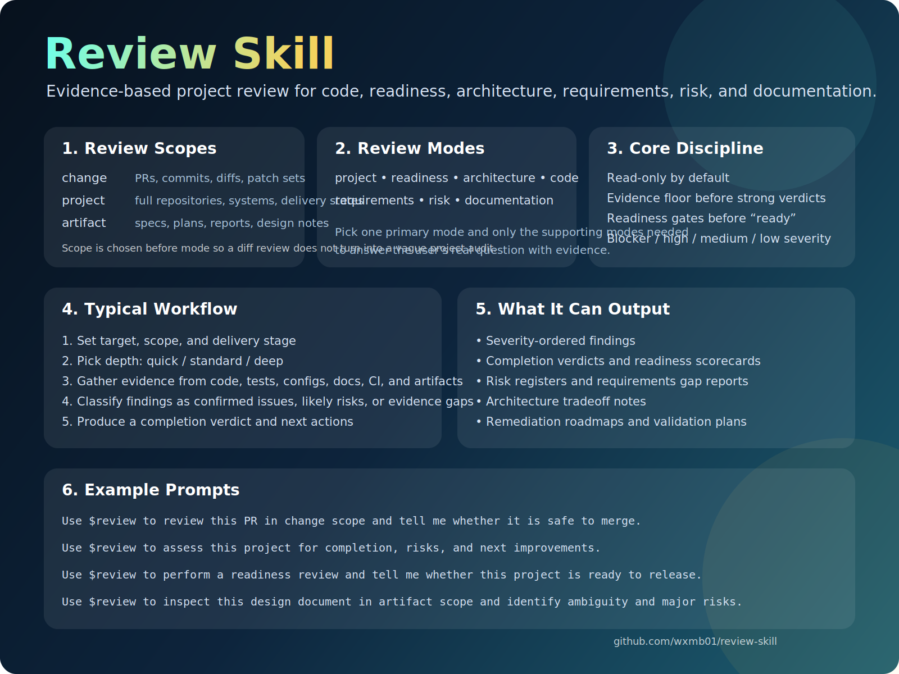

<p align="center">
  
</p>

<p align="center">
  <a href="./LICENSE"></a>
  <a href="https://github.com/wxmb01/review-skill/releases"></a>
  <a href="https://github.com/wxmb01/review-skill/stargazers"></a>
</p>

<h1 align="center">Review</h1>

<p align="center"><strong>Evidence-based review for pull requests, whole projects, and technical artifacts.</strong></p>

<p align="center">
  Judge completion, readiness, architecture, requirements, implementation quality, risk, and documentation with one open skill.
</p>

<p align="center">
  <a href="#install-in-10-seconds"><strong>Install</strong></a>
  ·
  <a href="https://github.com/wxmb01/review-skill/releases/latest"><strong>Latest Release</strong></a>
  ·
  <a href="./README.zh-CN.md"><strong>简体中文</strong></a>
</p>

> `Review` is built for the moment when a normal code review is too narrow.

## Why Teams Use Review

| Question | What Review gives back |
| --- | --- |
| Is this PR safe to merge? | severity-ordered findings, regression thinking, merge readiness |
| Is this project actually complete? | completion verdict, evidence gaps, next priorities |
| Is this release ready? | readiness gates, go/no-go summary, operational caveats |
| Is this design or plan solid enough? | ambiguity review, requirements gaps, tradeoff notes |

Review is read-only by default for review requests. It is designed to assess evidence, not just code style.

## Product Tour



Download-ready overview assets:

- [English overview PNG](./assets/overview-en.png)
- [Chinese overview PNG](./assets/overview-zh-CN.png)

## Three Scopes, One Workflow

| Scope | Best for | Typical result |
| --- | --- | --- |
| `change` | PRs, commits, diffs, patch sets, uncommitted work | merge recommendation, impacted areas, regression risk |
| `project` | whole repositories, delivery-state audits, product reviews | completion verdict, readiness summary, remediation roadmap |
| `artifact` | specs, plans, reports, design documents, architecture notes | ambiguity list, requirements gaps, tradeoff notes |

## Why It Feels Different

| Pillar | What it changes |
| --- | --- |
| Scope-first routing | change review, project audit, and artifact review do not get flattened into one generic prompt |
| Evidence floors | findings need proof, not vibes or vague confidence |
| Readiness gates | `ready` is treated as a claim that must be earned |
| Severity and risk framing | blocker, high, medium, low plus security, privacy, compliance, performance, and reliability |
| Code review rigor | diff-first workflow, high-risk change heuristics, automated-finding verification, and language-specific review guides |
| Reusable deliverables | scorecards, risk registers, gap reports, and roadmaps instead of loose commentary |

## Review Modes

| Mode | Best for |
| --- | --- |
| `project` | end-to-end repository or product review |
| `readiness` | submission, release, and delivery decisions |
| `architecture` | structure, boundaries, tradeoffs, and scalability |
| `code` | diff-first implementation review with regression, validation, high-risk change analysis, and stack-specific heuristics |
| `requirements` | coverage, ambiguity, acceptance criteria, and prioritization |
| `risk` | security, privacy, compliance, performance, and reliability |
| `documentation` | clarity, consistency, and handoff quality |

## Outputs You Can Expect

| Output | Why it is useful |
| --- | --- |
| severity-ordered findings | see blockers before polish comments |
| completion verdicts | understand whether work is actually done |
| readiness scorecards | make submit or release decisions with evidence |
| risk registers | capture threats, exposure, and mitigation priorities |
| requirements gap reports | surface missing or unclear scope |
| remediation roadmaps | turn review into next actions |

## Copy-Paste Prompts

```text
Use $review to assess this project for completion, risks, and next improvements.
```

```text
Use $review to review this PR in change scope and tell me whether it is safe to merge.
```

```text
Use $review to review this TypeScript and React PR in change scope, using stack-specific frontend checks for state, effects, runtime validation, and regression risk.
```

```text
Use $review to review this Python change in change scope, focusing on async safety, exception handling, data integrity, and test quality.
```

```text
Use $review to perform a readiness review and tell me whether this project is ready to submit or release.
```

```text
Use $review to inspect this design document in artifact scope and identify ambiguity, missing acceptance criteria, and major risks.
```

## Visual Assets

Social preview assets for GitHub and social sharing:

- [English social preview PNG](./assets/social-preview-en.png)
- [Chinese social preview PNG](./assets/social-preview-zh-CN.png)
- [English social preview SVG source](./assets/social-preview-en.svg)
- [Chinese social preview SVG source](./assets/social-preview-zh-CN.svg)

## Install in 10 Seconds

```bash
npx skills add https://github.com/wxmb01/review-skill --skill review -g -y
```

## Local Codex Sync

If you maintain this repository locally and also use the installed Codex skill at `~/.codex/skills/review`, this repo now includes a built-in sync script:

```bash
powershell -ExecutionPolicy Bypass -File .\scripts\sync-to-codex.ps1
```

The repository also includes local Git hooks in `.githooks/` for `post-commit`, `post-checkout`, `post-merge`, and `post-rewrite`.
When `core.hooksPath` is configured to `.githooks`, local updates and pulled changes will automatically sync the repo's `review/` folder back into the installed Codex skill directory.

## Open Source Workflow

- [Contributing guide](./CONTRIBUTING.md)
- [Security policy](./SECURITY.md)
- [Issues](https://github.com/wxmb01/review-skill/issues)
- [Pull requests](https://github.com/wxmb01/review-skill/pulls)

## Repository Layout

```text
.github/
  ISSUE_TEMPLATE/
    bug_report.yml
    config.yml
    feature_request.yml
  PULL_REQUEST_TEMPLATE.md
CONTRIBUTING.md
SECURITY.md
review/
  SKILL.md
  agents/
    openai.yaml
  references/
    review-axes.md
    review-code.md
    review-code-java.md
    review-code-python.md
    review-code-typescript-react.md
    review-playbook.md
    review-templates.md
scripts/
  sync-to-codex.ps1
.githooks/
  post-checkout
  post-commit
  post-merge
  post-rewrite
assets/
  overview-en.png
  overview-en.svg
  overview-zh-CN.png
  overview-zh-CN.svg
  review-banner.svg
  social-preview-en.png
  social-preview-en.svg
  social-preview-zh-CN.png
  social-preview-zh-CN.svg
```

## License

Released under the MIT License.
