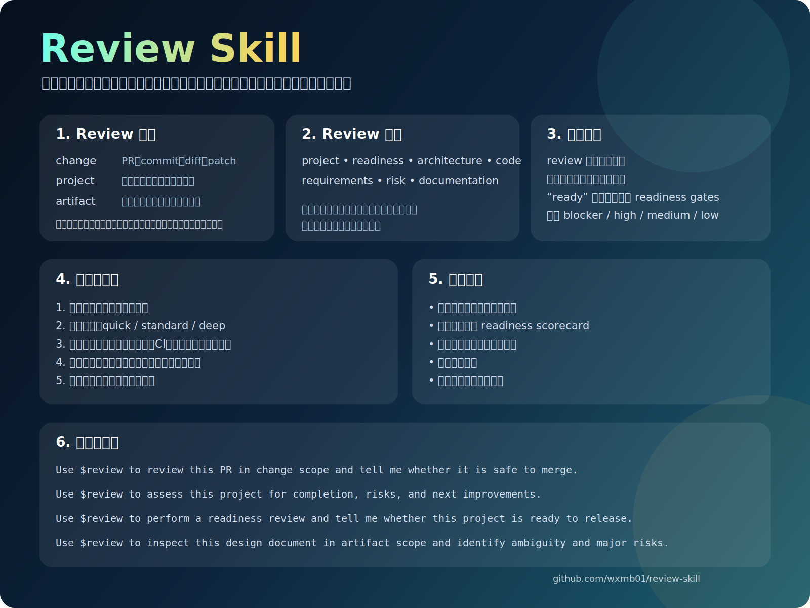

<p align="center">
  
</p>

<p align="center">
  <a href="./LICENSE"></a>
  <a href="https://github.com/wxmb01/review-skill/releases"></a>
  <a href="https://github.com/wxmb01/review-skill/stargazers"></a>
</p>

<h1 align="center">Review</h1>

<p align="center"><strong>面向 PR、完整项目和技术文档的证据驱动型评审 skill。</strong></p>

<p align="center">
  用一个开源 skill 判断完成度、上线准备度、架构质量、需求覆盖、实现质量、风险和文档交付质量。
</p>

<p align="center">
  <a href="#10-秒安装"><strong>安装</strong></a>
  ·
  <a href="https://github.com/wxmb01/review-skill/releases/latest"><strong>最新版本</strong></a>
  ·
  <a href="./README.md"><strong>English</strong></a>
</p>

> `Review` 是为“普通代码审查已经不够用”的场景设计的。

## 为什么会用 Review

| 你想回答的问题 | Review 会给你的结果 |
| --- | --- |
| 这个 PR 能不能安全合并？ | 严重级别排序的问题、回归风险、合并建议 |
| 这个项目到底做完了吗？ | 完成度结论、证据缺口、下一步优先级 |
| 现在能不能提交、上线或交付？ | readiness gates、go/no-go 摘要、关键 caveats |
| 这份设计或计划靠不靠谱？ | 歧义清单、需求缺口、架构取舍说明 |

在 review 请求下，`Review` 默认只读分析，不会擅自改文件。它强调的是证据判断，而不只是代码风格。

## 产品概览



可直接下载使用的介绍图：

- [英文介绍图 PNG](./assets/overview-en.png)
- [中文介绍图 PNG](./assets/overview-zh-CN.png)

## 三种范围，一套工作流

| 范围 | 最适合的场景 | 常见结果 |
| --- | --- | --- |
| `change` | PR、commit、diff、patch、未提交改动 | 合并建议、影响范围、回归风险 |
| `project` | 整个仓库、交付状态、完整项目审计 | 完成度结论、就绪摘要、整改路线图 |
| `artifact` | 需求文档、设计文档、计划、报告、架构说明 | 歧义清单、需求缺口、取舍说明 |

## 它和普通 Review 的区别

| 核心能力 | 带来的变化 |
| --- | --- |
| 先判范围再判模式 | PR review、项目审计、文档审查不会被压成一种泛化提示词 |
| 证据底线 | 没有证据的判断不会被当成可靠结论 |
| readiness gates | `ready` 不是一句感觉，而是需要被证明的结论 |
| 严重级别与风险框架 | blocker、high、medium、low 加上安全、隐私、合规、性能、可靠性 |
| 可复用交付物 | scorecard、risk register、gap report、roadmap，而不是散乱评论 |

## Review 模式

| 模式 | 最适合的任务 |
| --- | --- |
| `project` | 完整仓库或产品级审查 |
| `readiness` | 提交、发布、交付前的判断 |
| `architecture` | 结构、边界、扩展性和技术取舍 |
| `code` | 实现质量、正确性和可维护性 |
| `requirements` | 需求覆盖、歧义、验收标准和优先级 |
| `risk` | 安全、隐私、合规、性能和可靠性 |
| `documentation` | 文档清晰度、一致性和交接质量 |

## 你通常会得到什么输出

| 输出 | 价值 |
| --- | --- |
| 按严重级别排序的问题列表 | 先看到 blocker，再看细节优化 |
| 完成度结论 | 判断工作是否真的完成 |
| readiness scorecard | 用证据决定能不能提交或上线 |
| 风险登记表 | 记录风险、影响和缓解优先级 |
| 需求缺口报告 | 发现漏项和模糊项 |
| 整改路线图 | 把 review 结论转成下一步行动 |

## 可直接复制的提示词

```text
Use $review to assess this project for completion, risks, and next improvements.
```

```text
Use $review to review this PR in change scope and tell me whether it is safe to merge.
```

```text
Use $review to perform a readiness review and tell me whether this project is ready to submit or release.
```

```text
Use $review to inspect this design document in artifact scope and identify ambiguity, missing acceptance criteria, and major risks.
```

## Visual 资源

可用于 GitHub 和社交分享的 social preview：

- [英文 social preview PNG](./assets/social-preview-en.png)
- [中文 social preview PNG](./assets/social-preview-zh-CN.png)
- [英文 social preview SVG 源文件](./assets/social-preview-en.svg)
- [中文 social preview SVG 源文件](./assets/social-preview-zh-CN.svg)

## 10 秒安装

```bash
npx skills add https://github.com/wxmb01/review-skill --skill review -g -y
```

## 开源协作

- [贡献指南](./CONTRIBUTING.md)
- [安全策略](./SECURITY.md)
- [Issues](https://github.com/wxmb01/review-skill/issues)
- [Pull requests](https://github.com/wxmb01/review-skill/pulls)

## 仓库结构

```text
.github/
  ISSUE_TEMPLATE/
    bug_report.yml
    config.yml
    feature_request.yml
  PULL_REQUEST_TEMPLATE.md
CONTRIBUTING.md
SECURITY.md
review/
  SKILL.md
  agents/
    openai.yaml
  references/
    review-axes.md
    review-code.md
    review-playbook.md
    review-templates.md
assets/
  overview-en.png
  overview-en.svg
  overview-zh-CN.png
  overview-zh-CN.svg
  review-banner.svg
  social-preview-en.png
  social-preview-en.svg
  social-preview-zh-CN.png
  social-preview-zh-CN.svg
```

## 许可证

本仓库使用 MIT License 开源。
